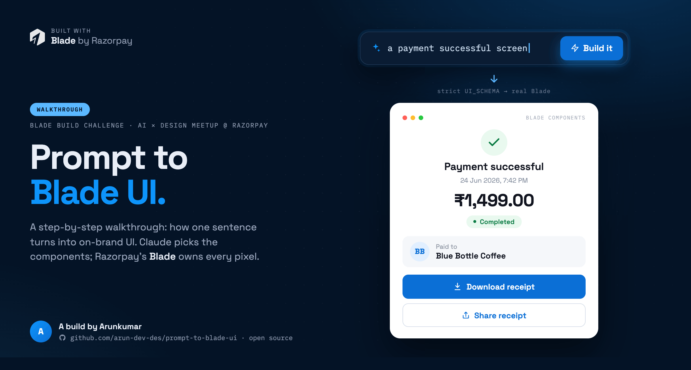
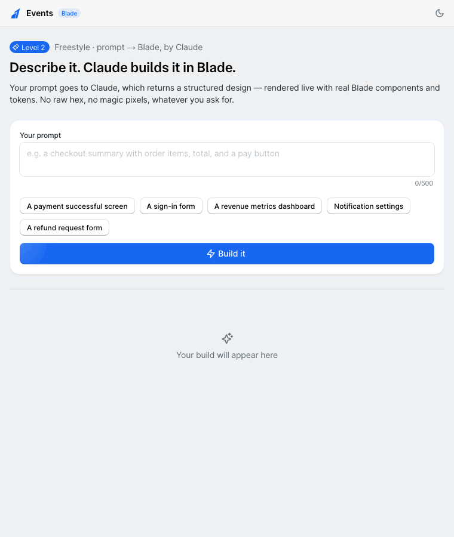

# Blade Studio — prompt → Blade UI, by Claude



[](https://razorpay-challenge.vercel.app) &nbsp;[](LICENSE) &nbsp;[](https://blade.razorpay.com)

**Describe a screen; Claude builds it live in Razorpay's [Blade](https://blade.razorpay.com)
design system.** Type a prompt → Claude returns a structured spec → it renders instantly as
real Blade components and tokens. No raw hex, no magic pixels — whatever you ask for.

> **AI makes the decisions. The design system guarantees the quality.**

🔗 **Live:** https://razorpay-challenge.vercel.app



Built for Razorpay's **Blade Build Challenge** — from a phone, with
[Claude Code](https://claude.com/claude-code), deployed to Vercel.

---

## The idea in one line

The AI **never writes code.** It fills a locked, parts-only form (a JSON schema), and
deterministic code turns that form into real Blade components. So **the model owns content
and arrangement; the design system owns styling** — and the output is *guaranteed*
on-system, not hopefully on-system.

→ Full write-up: **[ARCHITECTURE.md](./ARCHITECTURE.md)**

## How it works (30 seconds)

```
You type a prompt
   → POST to a Vercel serverless function (the only place the Anthropic key lives)
   → Claude (claude-opus-4-8) replies under a STRUCTURED-OUTPUT constraint:
     its answer MUST match a fixed Blade schema — it can't return free-form code
   → a deterministic renderer maps that spec to real Blade components + tokens
   → you see it live, with a Preview / Code tab pair (the Code tab is the exact JSX)
```

If `ANTHROPIC_API_KEY` isn't set (or Claude errors), the studio falls back to a library of
local keyword-matched Blade recipes — so it **never breaks**, it degrades.

## Run it

```bash
npm install            # .npmrc pins --legacy-peer-deps (Blade lists RN peers a web app skips)
```

**Frontend only** (recipe fallback — no live AI):
```bash
npm run dev            # open the printed localhost URL
```

**Full app with live Claude** — needs the serverless function, so use `vercel dev`:
```bash
echo 'ANTHROPIC_API_KEY=sk-ant-...' > .env.local   # no quotes; .env.local is gitignored
export ANTHROPIC_API_KEY=$(grep '^ANTHROPIC_API_KEY=' .env.local | cut -d= -f2-)
npx vercel dev --listen 3000                        # then open http://localhost:3000
```

> **Gotcha:** `vercel dev` doesn't reliably inject `.env.local` into the function process —
> a blank "Sensitive" `ANTHROPIC_API_KEY` from the linked Vercel project can shadow it.
> Exporting the var into the shell *before* launching (line 2) is what makes it stick.
> Sanity check: `curl -s localhost:3000/api/generate` should report `"keyConfigured":true`.

## Deploy (Vercel)

Import the repo at [vercel.com](https://vercel.com) → **Add New → Project** (Vite is
auto-detected; `vercel.json` + `.npmrc` pin install/build). Set one env var —
`ANTHROPIC_API_KEY` — in **Settings → Environment Variables**. Or via CLI: `npx vercel --prod`.
Never commit a key (see [`.env.example`](./.env.example)).

## Project map

```
api/
  generate.ts            # serverless fn: Claude call + the on-system schema/prompt (key lives here)
src/
  App.tsx                # one <BladeProvider> + <ToastContainer>, renders the studio
  components/
    PageHeader.tsx       # sticky bar + dark-mode toggle (useTheme().setColorScheme)
    Reveal.tsx           # entrance animation driven by Blade motion tokens
  level2/
    Playground.tsx       # the studio entry
    PromptStudio.tsx     # prompt box, build flow, Preview/Code tabs, state machine
    uiSchema.ts          # THE CONTRACT — the Blade vocabulary Claude must fill (types + JSON schema)
    SchemaRenderer.tsx   # maps a spec → real Blade components + tokens
    screenToJsx.ts       # the inverse — spec → copy-pasteable Blade JSX (Code tab)
    recipes.tsx          # local keyword-matched fallback compositions
    PaymentSuccess.tsx   # one such recipe
BLADE_KIT.md             # the Blade playbook used while building (distilled into the runtime prompt)
ARCHITECTURE.md          # how it all fits together
```

## On-system discipline

- **Blade components + tokens only** — no raw hex, no magic pixels anywhere. Every color,
  spacing, radius, and motion value resolves through `@razorpay/blade/tokens`.
- **Structurally enforced** — Claude can only emit the schema's vocabulary, and the renderer
  only ever outputs real Blade bricks. Off-system output is mechanically impossible.
- **Dark-mode safe, responsive, accessible** — token color pairs, `{ base, m, l }` props,
  labelled controls, ≥44px targets.

Built against `@razorpay/blade@12.98.1` · model `claude-opus-4-8`.
